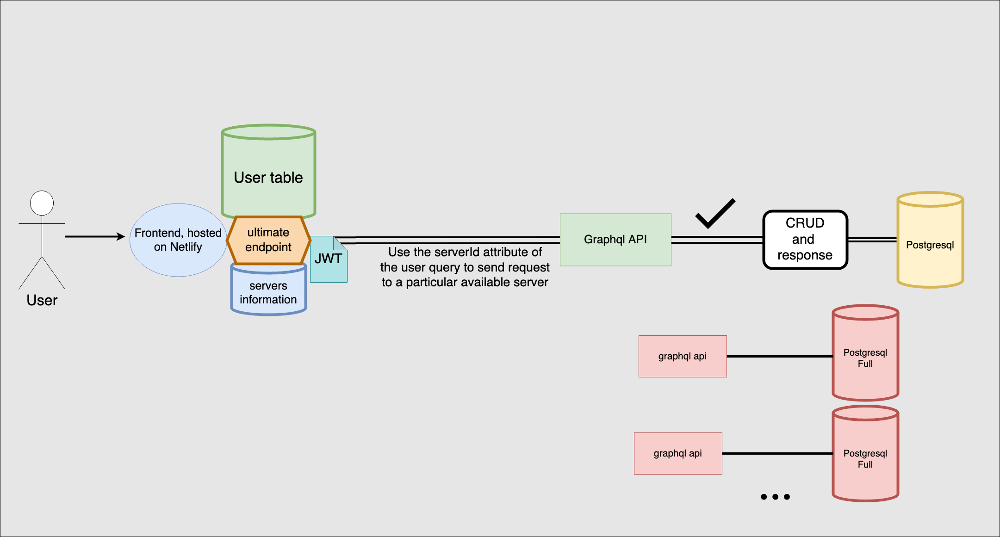

# August 2

Let's go boys, we solved the issue. It's just the new version of apollo client that's crashing the entire website.

# July 25

Finally we migrated to nextjs!

# July 21

Hey guys, I'm back!!!!!!!!!

# July 14

New diagram

# July 13

Stopped using apollo federation as it doesn't fit this project well, decided to connect to multiple apollo endpoints instead.

# July 7

Transform the middleware into an apollo gateway.

# July 5, 2021

Got all 5 servers(1 user + 4 db servers) hosted on heroku ready for testing.

# July 4, 2021

Got a user server + redis up and running on heroku and redis lab.

# July 3, 2021

Completed forgot password + confirm email.
