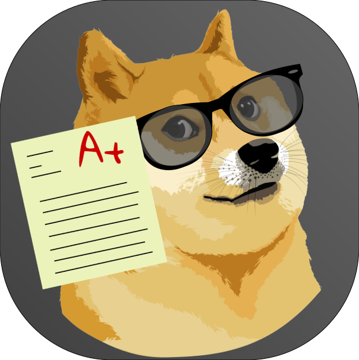

<a href="https://yourdoge.netlify.app">
  

    
  

  

    
  

</a>

  
  

  <strong>Doge Themed Homework Manager 💻</strong>

<h3 align="center">
  <a href="CONTRIBUTING.md">Contribute</a>
   · 
  <a href="https://yourdoge.netlify.app">Production</a>
</h3>

---

## About Your Doge

Your Doge is a doge themed online homework manager built for the ones who are struggling with organizing their homework, although it also fits other sorts of tasks. Your Doge provides personalized statistics on how well you are doing based on your activities and gives suggestions based on that.

## Contributing

We are open to any issues, pull requests, and comments on how we can make Your Doge better.

## Branches

- production -> don't make any changes here
- staging -> open to pull requests

## Attributions

Avatars(excluding doge): [Laura Reen](https://www.iconfinder.com/laurareen)
