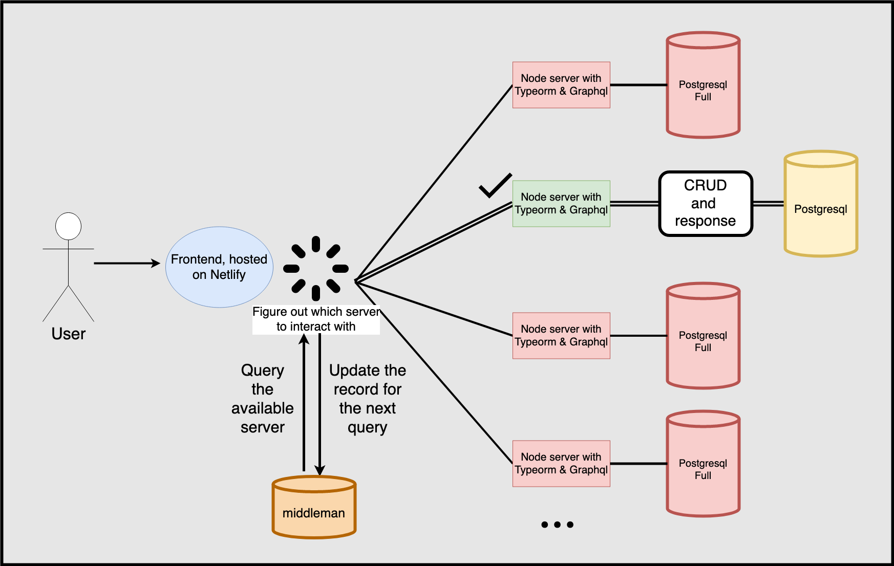

# Homework Manager

A very nice homework manager that makes your life easier.

The following part is for the developers(actually the only developer :) )

---

## Plan

Because of the damn limit on the heroku database, we have to design in in a different way. First, we define a `working-pair` as the combination of a frontend application and a backend server(with apollo and graphql, and nodejs stuff), and for each `working-pair`, we need a fresh new backend server and a fresh new frontend application, essentially, we are going to limit the number of users and the number of homework items per user(roughly 20 \* 598), because we need a few rows for the subjects as well. Once a pair is full(I mean the database of course, what are you expecting?), we redirect our user to a new working-pair and let them register there. Additionally, when a user reaches the limit of 598 items, we warn(or encourage if you will) him/her to register a new account on the new site. But, to make this a bit more convenient, we can create a middle man, just like a load balancer, but it stores the information about which server is full and which is not, so that way the user doesn't have to remember whole lots of URLS, and also won't experience a redirection chain(you know what I mean).

Sounds legit, huh? Who knows whether it works or not...

### **_UPDATE(LITERALLY FIVE MINUTES AFTER FIGURED OUT THE PLAN)_**

We don't need any sorts of middle man, we can just use a middleman server, that stores all of the information about the other servers that actually store user/homework data, and once a user visits, we decide which backend API to call based on that middleman.

### **_UPDATE(Diagram)_**

### **_UPDATE(new stuff)_**

First things first, let's host the servers.

## Some features and/or functionalities I want to implement

Discussion forum...
